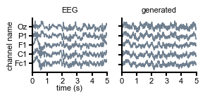
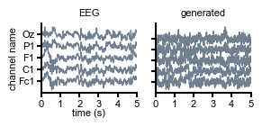
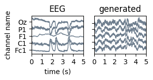
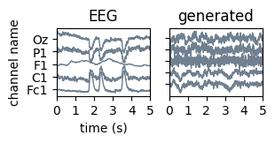
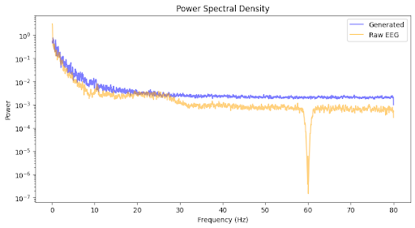
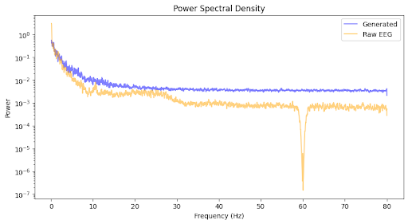

This repo uses code from [https://github.com/mackelab/smc_rnns/tree/main](https://github.com/mackelab/smc_rnns/tree/main)
## Setup

To replicate the environment used for this analysis, run the following commands in your terminal:
Create the environment from the provided YAML file
```bash
conda env create -f smc_rnn_env_postdoc_test.yml
```
Activate the environment
```bash
conda activate postdoc_test_env
```
All the code is in rmb_stuff/
# Project Report: Evaluating Low-Rank RNNs on EEG Data

## 1. Evaluating Low-Rank RNN 

**Reference paper with codebase:** Pals et al., *Inferring Stochastic Low-Rank Recurrent Neural Networks from Neural Data*, 2024.

### 1.1 Replicate Figure 4 (Easy)
**Code:** `Fig_4_plot_EEG_rbm.ipynb`
It is almost identical to `generate_figures/Fig_4_plot_EEG.ipynb` from the original repo. 

It is up and running. However, it is a bit unclear whether I was expected to fit the model on my machine and use new weights (especially since in the next section it is said “Once the RNN is fitted and generating data”). I did not refit the model; instead, I used the weights provided by the authors. 

It is clear from this notebook that one can use the function `vi_rnn.generate` to project real data into the hidden space and ultimately generate EEG-like data.
 

### 1.2 Decoding comparison: real vs. generated data 
**Code:** `explore_Physionet_MI.ipynb`, `decode_subj_1_rest_vs_task_real_vs_gen.ipynb`

As said before, I simply used the model weights already provided by the authors to get generated data. Since the model is trained on subject **S001** of the dataset, I will focus on this one subject. 

I have at my disposal 14 runs that include rest, closing one of both fists, closing both fists, or both feet (real movement or imagination). A straightforward decoding paradigm would be **“Rest” versus “Task”**. I decided to use the real movement tasks only for simplicity and because I expect them to contain more salient differences with the “Rest” data. 

Since the RNN takes z-scored EEG data as input, I z-scored all the epochs to be sure to compare apples with apples.

---

#### Data Preparation
* I downloaded the dataset. I loaded and concatenated the raw data of runs that contain the movement tasks: `'S001R03.edf'`, `'S001R05.edf'`, `'S001R07.edf'`, `'S001R09.edf'`, `'S001R11.edf'`, `'S001R13.edf'`.
* I then filtered the signal between **8 and 30 Hz** (classic choice for motor task classification). 
* I kept an unfiltered copy of it to feed it to the RNN. A not filtered copy was saved for the RNN sampling step.
* Each trial was then fed the low-rank RNN to generate the corresponding sampled data and filtered afterwards.
* The epochs are 4s long, so we can afford to split them to augment the number of samples. I split them into 2, which gives us 360 trials of dimension (64 channels, 320 time points = 2s), and 360 labels (0: “Rest”, 1: “Task”). 

---

#### Decoding “Rest” vs “Task”
I tested several classifiers. I will only report the two best: **(CSP + SVM)** and **(Riemannian covariances + SVM)**. I used a 5-split cross-correlation to calculate the accuracy.

We can see from the table below that the classifiers learned to discriminate the task segments from the resting state. However, when trained on the generated data, they give a chance-level score.

**Table 1: Accuracy scores**

| Method | Real Data | Generated Data |
| :--- | :--- | :--- |
| **CSP + SVM** | 0.64 (+/- 0.06) | 0.48 (+/- 0.04) |
| **Riemann + SVM** | 0.70 (+/- 0.07) | 0.50 (+/- 0.05) |

---

#### Interpretation
It is quite evident that, since the RNN was only trained on the “opened eyes resting state”, the decoding method would fail on the subsequently “generated” dataset. Even though the low-rank RNN can very well reproduce the temporal characteristics of EEG data, it can certainly not preserve the information about “unseen mental states” (motor task here).

I can formulate two statements here:
1. The classifier succeeds with the real data but fails with the RNN-generated data, suggesting that the RNN does not capture the full variability and complexity of the task-evoked signals.
2. If the RNN is trained on longer data containing both classes of signals, one could achieve higher decoding accuracy.

---

### 1.3 Future direction
**Code:** `explore_Physionet_MI.ipynb` (to get the z-scored data), `train_EEG_rbm.ipynb` (to retrain the RNN on the new segement), `decode_subj_1_rest_vs_task_real_vs_gen_retrained_model.ipynb`

In an attempt to corroborate my previous interpretation, I decided to retrain the low-rank RNN on data containing both rest and motor tasks (2-minute segment: concatenation of 1min run_3 and 1min run_5). Then I tried the decoding task again, but I got similar results (around 0.7 accuracy with real data and 0.5 with generated data).

The KL divergence metric of the training was **NaN** though, so probably, the training did not converge. In addition, the generated data are messier and noisier now, with this retrained model.

The elements I have at this stage cannot sufficiently support my previous intuition.

| with weights given by the paper | with weights that I obtained |
| :--- | :--- |
| |  |

#### Training Summary (WandB):
* **KL_data:** nan
* **alpha:** 0.31547
* **ll:** -56.71944
* **lr:** 0.0
* **mean_rate_error:** 0.73998
* **power_spectr_distance:** 0.70864

---

## 2. Apply the full pipeline to a new EEG dataset (Advanced)
**Code:** `explore_Forenzo2023.ipynb` (to get the z-scored data), `train_EEG_rbm_Forenzo.ipynb` (to train the RNN on the new data)`decode_Forenzo2023_real_vs_gen.ipynb`

In order to find a suitable database, I browsed the dataset summary page of the MOABB website for those having Motor imagery/execution tasks, containing 64 EEG electrodes, and preferably with a sampling frequency $Fs \ge 160Hz$.

These criteria brought the search down to:
* **Forenzo2023**
* **GutmannFlury_2025_MI**

The GutmannFlury_2025_MI data has huge artifacts, certainly coming from the triggers. So I used **Forenzo2023**. It has right versus left-hand motor imagery trials.

#### Data loading and preparation
* The original paper did not specify whether or not they performed “average” referencing. So I trained the RNN twice (with and without).
* In an effort to have data similar to the Physionet one, I downsampled to $Fs = 160 Hz$.
* This dataset does not contain “rest” epochs, only “right hand” and “left hand”.
* I isolated the first 58s of the Run 1 for Subject 1, which contains 4 of each condition. I z-scored and smoothed it using the same Hanning window as the original paper.
* I trained the RNN, and still the KL metric was **NaN**. So at this point, I am still not confident in the resulting model.
* The generated data also looks messier and noisier than the ones generated via the paper checkpoint weights. We can see a higher noise level in the power spectra.

| with weights given by the paper | with weights that I obtained |
| :--- | :--- |
| | |
| |  |
#### Decoding task 
Since this dataset does not contain “rest” epochs, we classify **Right against Left**. As previously, I used data-augmentation and a 5-split cross-correlation to calculate the accuracy.

**Table 2: Accuracy scores for Forenzo_2023 (Right vs Left)**

| Method | Real Data | Generated Data |
| :--- | :--- | :--- |
| **CSP + SVM** | 0.77 (+/- 0.11) | 0.58 (+/- 0.2) |
| **Riemann + SVM** | 0.66 (+/- 0.08) | 0.51 (+/- 0.16) |

#### Interpretation 
Since I am not confident in the model, I cannot draw conclusions from these additional simulations. I would need more time to figure out why I cannot safely retrain the model. 

A first step would be to try to replicate the training with open eyes from Physionet with another subject. Maybe contact the authors to ask what they mean by ‘raw data’ (was there “average” referencing, or minimal filtering?).